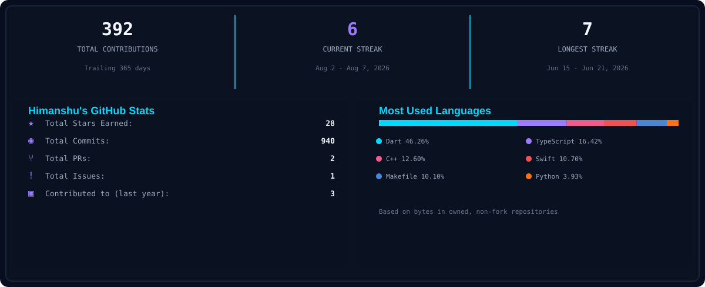
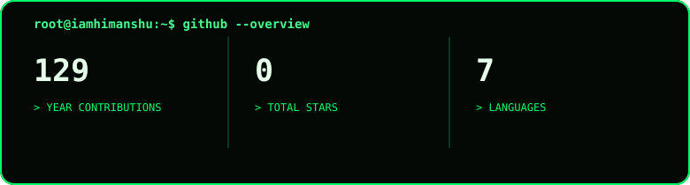

  

  <a href="https://www.iamhimanshu.in/">Portfolio</a> &middot;
  <a href="https://github.com/iamhimanshu108">GitHub</a> &middot;
  <a href="https://www.linkedin.com/in/iamhimanshu108/">LinkedIn</a> &middot;
  <a href="https://x.com/iamhimanshu108">X</a> &middot;
  <a href="https://www.instagram.com/iamhimanshu108/">Instagram</a>

<<<<<<< HEAD
  
=======
  
  

  
>>>>>>> parent of 1d556e6 (update)

  

